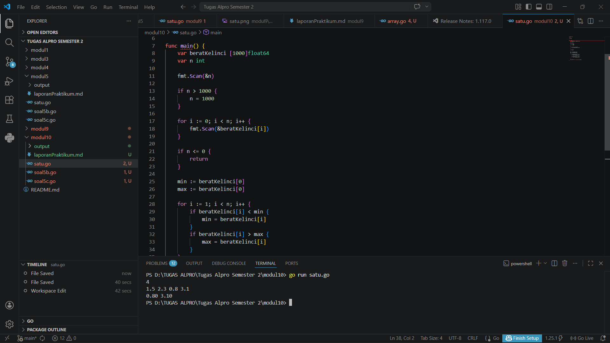
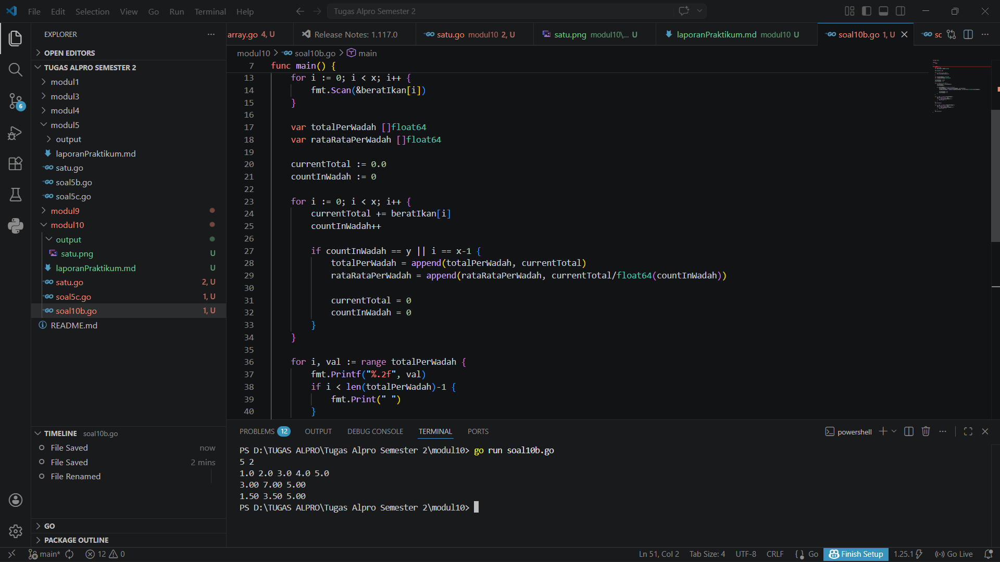
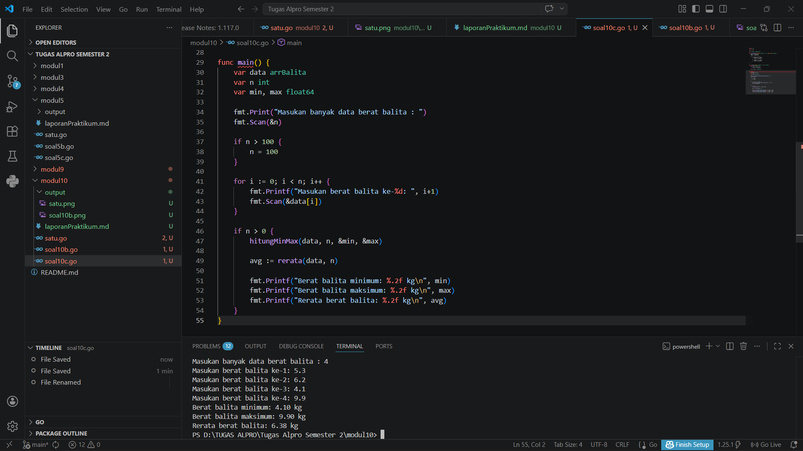

# <h1 align="center">Laporan Praktikum Modul 10- ... </h1>
<p align="center">Wahhaj - 109082530020</p>

## Unguided 

### 1. [Soal modul 10A]
#### satu.go

```go
package main

import (
	"fmt"
)

func main() {
	var beratKelinci [1000]float64
	var n int

	fmt.Scan(&n)

	if n > 1000 {
		n = 1000
	}

	for i := 0; i < n; i++ {
		fmt.Scan(&beratKelinci[i])
	}

	if n <= 0 {
		return
	}

	min := beratKelinci[0]
	max := beratKelinci[0]

	for i := 1; i < n; i++ {
		if beratKelinci[i] < min {
			min = beratKelinci[i]
		}
		if beratKelinci[i] > max {
			max = beratKelinci[i]
		}
	}

	fmt.Printf("%.2f %.2f\n", min, max)
}
```
### Output Unguided :

##### Output 

[penjelasan]
  Jadi kode tersebut digunakan untuk mendata berat anak kelinci yang akan dijual ke pasar.

  ### 2. [Soal modul 10B]
#### soal10b.go

```go
package main

import (
	"fmt"
)

func main() {
	var x, y int
	var beratIkan [1000]float64
	
	fmt.Scan(&x, &y)

	for i := 0; i < x; i++ {
		fmt.Scan(&beratIkan[i])
	}

	var totalPerWadah []float64
	var rataRataPerWadah []float64

	currentTotal := 0.0
	countInWadah := 0

	for i := 0; i < x; i++ {
		currentTotal += beratIkan[i]
		countInWadah++

		if countInWadah == y || i == x-1 {
			totalPerWadah = append(totalPerWadah, currentTotal)
			rataRataPerWadah = append(rataRataPerWadah, currentTotal/float64(countInWadah))
			
			currentTotal = 0
			countInWadah = 0
		}
	}

	for i, val := range totalPerWadah {
		fmt.Printf("%.2f", val)
		if i < len(totalPerWadah)-1 {
			fmt.Print(" ")
		}
	}
	fmt.Println()

	for i, val := range rataRataPerWadah {
		fmt.Printf("%.2f", val)
		if i < len(rataRataPerWadah)-1 {
			fmt.Print(" ")
		}
	}
	fmt.Println()
}

```
### Output Unguided :

##### Output 

[penjelasan]
 Jadi kode tersebut digunakan untuk menentukan tarif ikan yang akan dijual ke pasar.


### 3. [Soal modul 10C]
#### soal10c.go

```go
package main

import "fmt"

type arrBalita [100]float64

func hitungMinMax(arrBerat arrBalita, n int, bMin, bMax *float64) {
	*bMin = arrBerat[0]
	*bMax = arrBerat[0]

	for i := 1; i < n; i++ {
		if arrBerat[i] < *bMin {
			*bMin = arrBerat[i]
		}
		if arrBerat[i] > *bMax {
			*bMax = arrBerat[i]
		}
	}
}

func rerata(arrBerat arrBalita, n int) float64 {
	var total float64 = 0
	for i := 0; i < n; i++ {
		total += arrBerat[i]
	}
	return total / float64(n)
}

func main() {
	var data arrBalita
	var n int
	var min, max float64

	fmt.Print("Masukan banyak data berat balita : ")
	fmt.Scan(&n)

	if n > 100 {
		n = 100
	}

	for i := 0; i < n; i++ {
		fmt.Printf("Masukan berat balita ke-%d: ", i+1)
		fmt.Scan(&data[i])
	}

	if n > 0 {
		hitungMinMax(data, n, &min, &max)
		
		avg := rerata(data, n)

		fmt.Printf("Berat balita minimum: %.2f kg\n", min)
		fmt.Printf("Berat balita maksimum: %.2f kg\n", max)
		fmt.Printf("Rerata berat balita: %.2f kg\n", avg)
	}
}

```
### Output Unguided :

##### Output 

[penjelasan]
  Jadi kode tersebut digunakan untuk mencatat data berat balita (dalam kg) dalam sebuah posyandu.