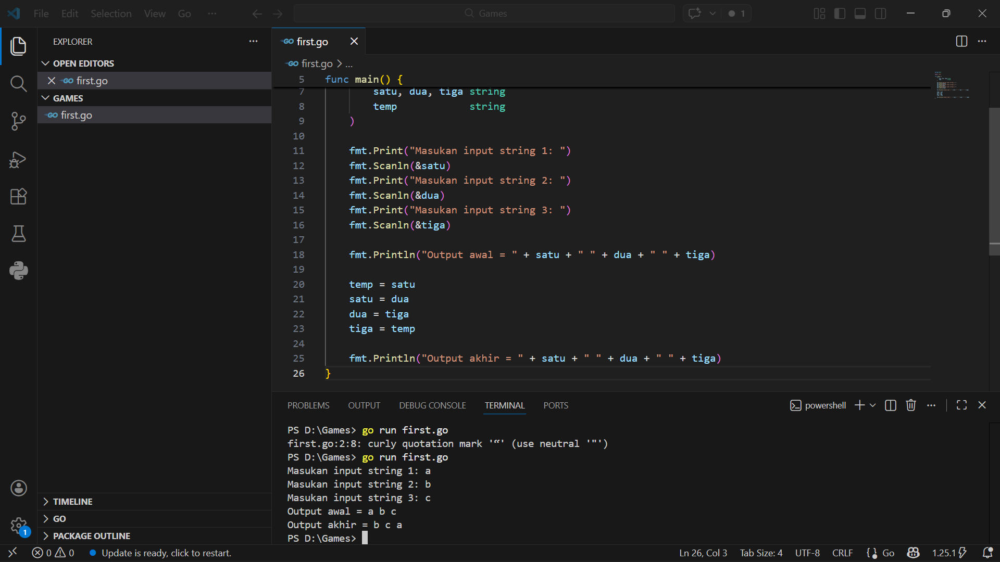
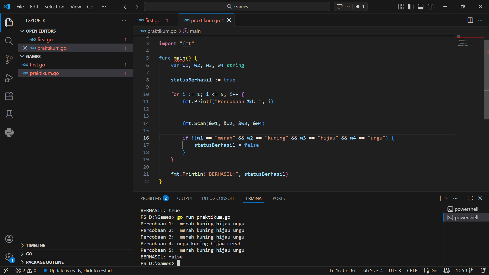
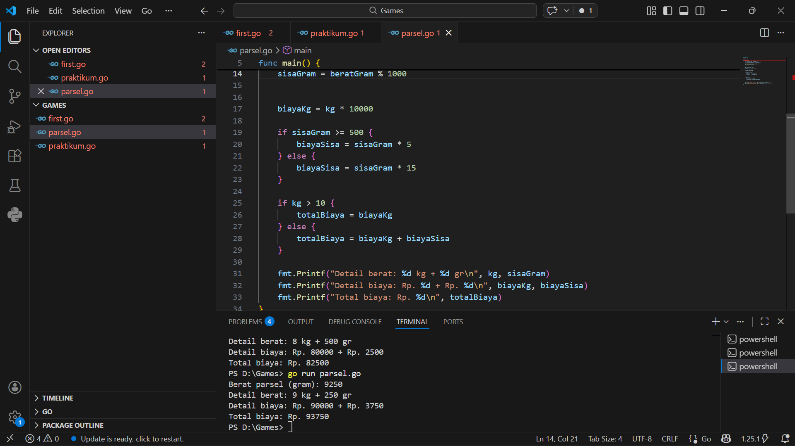

# <h1 align="center">Laporan Praktikum Modul 3- ... </h1>
<p align="center">Wahhaj - 109082530020</p>

## Unguided 

### 1. [Soal modul 3A]
#### satu.go

```go
package main

import (
	"fmt"
)

func factorial(n int) int64 {
	var res int64 = 1
	for i := 1; i <= n; i++ {
		res *= int64(i)
	}
	return res
}

func permutation(n, r int) int64 {

	return factorial(n) / factorial(n-r)
}

func combination(n, r int) int64 {
	
	return permutation(n, r) / factorial(r)
}

func main() {
	var a, b, c, d int

	_, err := fmt.Scan(&a, &b, &c, &d)
	if err != nil {
		return
	}


	fmt.Printf("%d %d\n", permutation(a, c), combination(a, c))

	fmt.Printf("%d %d\n", permutation(b, d), combination(b, d))
}

```
### Output Unguided :

##### Output 

[penjelasan]
  Jadi kode itu digunakan untuk menggeser posisi nilai variabel

  ### 2. [Soal modul 2B]
#### soal2b.go

```go
package main

import "fmt"

func main() {
	

	var w1, w2, w3, w4 string

	hasilAkhir := true

	for i := 1; i <= 5; i++ {
		fmt.Printf("Percobaan %d: ", i)
	
		fmt.Scan(&w1, &w2, &w3, &w4)

	
		if w1 != "merah" || w2 != "kuning" || w3 != "hijau" || w4 != "ungu" {
			hasilAkhir = false
		}
	}
	fmt.Printf("BERHASIL: %t\n", hasilAkhir)
}

```
### Output Unguided :

##### Output 

[penjelasan]
 Jadi kode itu digunakan untuk melakukan pengecekan string di dalam sebuah perulangan sebanyak 5 kali,jika ada satu yang tidak sama maka bisa dikatakan false.


### 3. [Soal modul 2C]
#### soal2c.go

```go
package main

import "fmt"

func main() {
	var beratGram int
	fmt.Print("Berat parsel (gram): ")
	fmt.Scan(&beratGram)

	kg := beratGram / 1000
	sisaGram := beratGram % 1000


	biayaKg := kg * 10000


	var biayaSisa int
	if sisaGram >= 500 {
		biayaSisa = sisaGram * 5
	} else {
		biayaSisa = sisaGram * 15
	}

	totalBiaya := biayaKg + biayaSisa
	if kg > 10 {
		totalBiaya = biayaKg
	}

	
	fmt.Printf("Detail berat: %d kg + %d gr\n", kg, sisaGram)
	fmt.Printf("Detail biaya: Rp. %d + Rp. %d\n", biayaKg, biayaSisa)
	fmt.Printf("Total biaya: Rp. %d\n", totalBiaya)
}


```
### Output Unguided :

##### Output 

[penjelasan]
  Jadi kode tersebut digunakan untuk biaya pengiriman berdasarkan berat paket dalam sebuah gram.