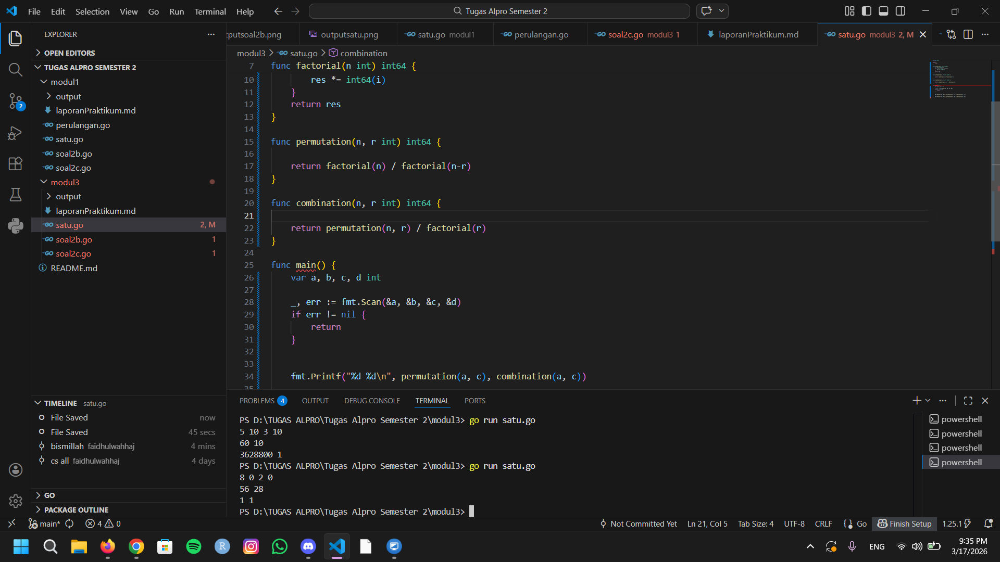
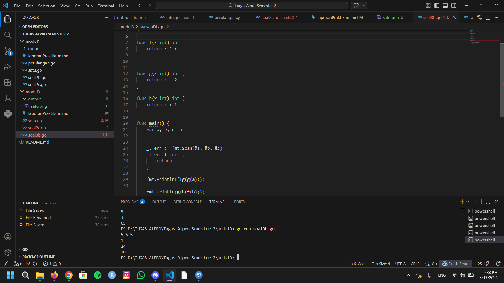
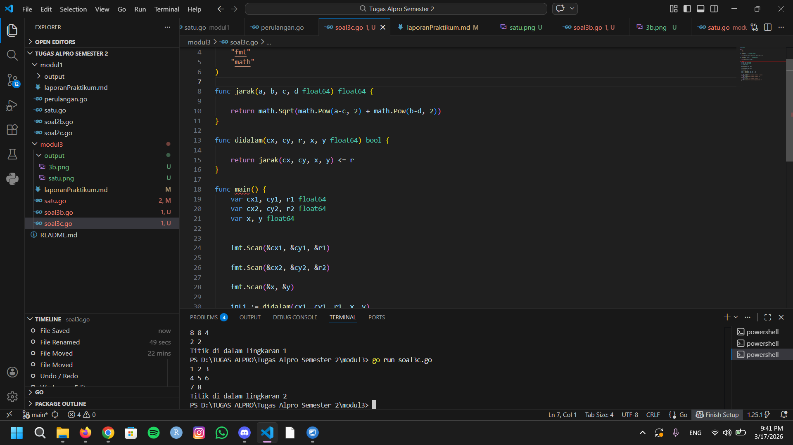

# <h1 align="center">Laporan Praktikum Modul 3- ... </h1>
<p align="center">Wahhaj - 109082530020</p>

## Unguided 

### 1. [Soal modul 3A]
#### satu.go

```go
package main

import (
	"fmt"
)

func factorial(n int) int64 {
	var res int64 = 1
	for i := 1; i <= n; i++ {
		res *= int64(i)
	}
	return res
}

func permutation(n, r int) int64 {

	return factorial(n) / factorial(n-r)
}

func combination(n, r int) int64 {
	
	return permutation(n, r) / factorial(r)
}

func main() {
	var a, b, c, d int

	_, err := fmt.Scan(&a, &b, &c, &d)
	if err != nil {
		return
	}


	fmt.Printf("%d %d\n", permutation(a, c), combination(a, c))

	fmt.Printf("%d %d\n", permutation(b, d), combination(b, d))
}

```
### Output Unguided :

##### Output 

[penjelasan]
  Jadi kode tersebut digunakan menghitung objek dari sekumpulan data.

  ### 2. [Soal modul 3B]
#### soal3b.go

```go
package main

import (
	"fmt"
)

func f(x int) int {
	return x * x
}


func g(x int) int {
	return x - 2
}

func h(x int) int {
	return x + 1
}

func main() {
	var a, b, c int


	_, err := fmt.Scan(&a, &b, &c)
	if err != nil {
		return
	}

	fmt.Println(f(g(g(a))))

	fmt.Println(g(h(f(b))))

	fmt.Println(h(f(g(c))))
}

```
### Output Unguided :

##### Output 

[penjelasan]
 Jadi kode tersebut digunakan untuk menghitung komposisi fungsi matematika dalam pemrograman.


### 3. [Soal modul 3C]
#### soal3c.go

```go
package main

import (
	"fmt"
	"math"
)

func jarak(a, b, c, d float64) float64 {
	
	return math.Sqrt(math.Pow(a-c, 2) + math.Pow(b-d, 2))
}

func didalam(cx, cy, r, x, y float64) bool {
	
	return jarak(cx, cy, x, y) <= r
}

func main() {
	var cx1, cy1, r1 float64
	var cx2, cy2, r2 float64
	var x, y float64


	fmt.Scan(&cx1, &cy1, &r1)
	
	fmt.Scan(&cx2, &cy2, &r2)
	
	fmt.Scan(&x, &y)

	inL1 := didalam(cx1, cy1, r1, x, y)
	inL2 := didalam(cx2, cy2, r2, x, y)

	if inL1 && inL2 {
		fmt.Println("Titik di dalam lingkaran 1 dan 2")
	} else if inL1 {
		fmt.Println("Titik di dalam lingkaran 1")
	} else if inL2 {
		fmt.Println("Titik di dalam lingkaran 2")
	} else {
		fmt.Println("Titik di luar lingkaran 1 dan 2")
	}
}


```
### Output Unguided :

##### Output 

[penjelasan]
  Jadi kode tersebut digunakan untuk menghitung geometri kumputasi sederhana yang berfungsi untuk mengecek posisi sebuah titik.