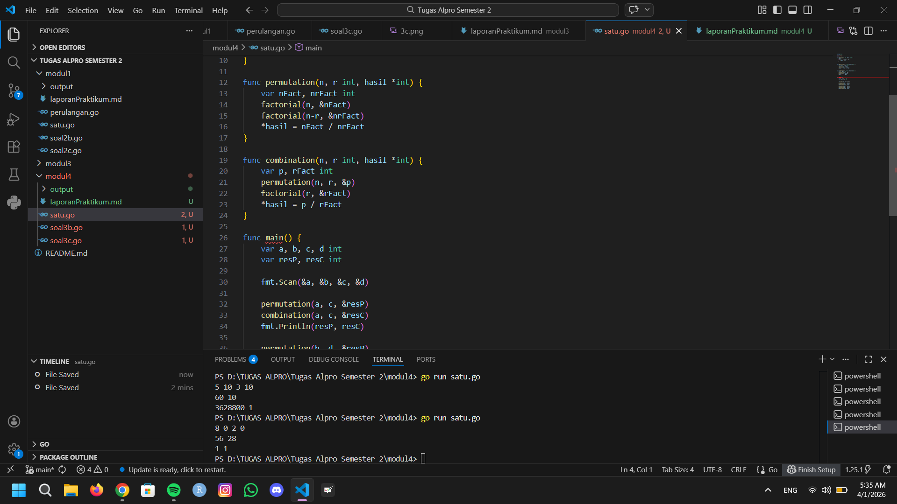
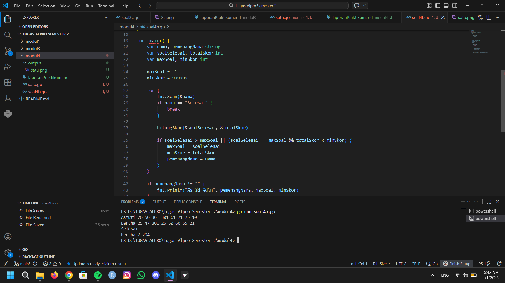

# <h1 align="center">Laporan Praktikum Modul 4- ... </h1>
<p align="center">Wahhaj - 109082530020</p>

## Unguided 

### 1. [Soal modul 4A]
#### satu.go

```go
package main

import "fmt"

func factorial(n int, hasil *int) {
	*hasil = 1
	for i := 2; i <= n; i++ {
		*hasil *= i
	}
}

func permutation(n, r int, hasil *int) {
	var nFact, nrFact int
	factorial(n, &nFact)
	factorial(n-r, &nrFact)
	*hasil = nFact / nrFact
}

func combination(n, r int, hasil *int) {
	var p, rFact int
	permutation(n, r, &p)
	factorial(r, &rFact)
	*hasil = p / rFact
}

func main() {
	var a, b, c, d int
	var resP, resC int

	fmt.Scan(&a, &b, &c, &d)

	permutation(a, c, &resP)
	combination(a, c, &resC)
	fmt.Println(resP, resC)

	permutation(b, d, &resP)
	combination(b, d, &resC)
	fmt.Println(resP, resC)
}

```
### Output Unguided :

##### Output 

[penjelasan]
  Jadi kode tersebut digunakan untuk mempelajari suatu kombinasi dan permutasi pada pelajaran matematika diskrit.

  ### 2. [Soal modul 4B]
#### soal4b.go

```go
package main

import "fmt"

func hitungSkor(soal *int, skor *int) {
	var waktu int
	*soal = 0
	*skor = 0

	for i := 0; i < 8; i++ {
		fmt.Scan(&waktu)
		if waktu <= 300 { 
			*soal++
			*skor += waktu
		}
	}
}

func main() {
	var nama, pemenangNama string
	var soalSelesai, totalSkor int
	var maxSoal, minSkor int

	maxSoal = -1
	minSkor = 999999

	for {
		fmt.Scan(&nama)
		if nama == "Selesai" {
			break
		}

		hitungSkor(&soalSelesai, &totalSkor)

		if soalSelesai > maxSoal || (soalSelesai == maxSoal && totalSkor < minSkor) {
			maxSoal = soalSelesai
			minSkor = totalSkor
			pemenangNama = nama
		}
	}

	if pemenangNama != "" {
		fmt.Printf("%s %d %d\n", pemenangNama, maxSoal, minSkor)
	}
}

```
### Output Unguided :

##### Output 

[penjelasan]
 Jadi kode tersebut digunakan untuk membuat prosedur hitung skor yang mengembalikan total soal dam total skor yang dikerjakan oleh seorang peserta melalui parameter formal

