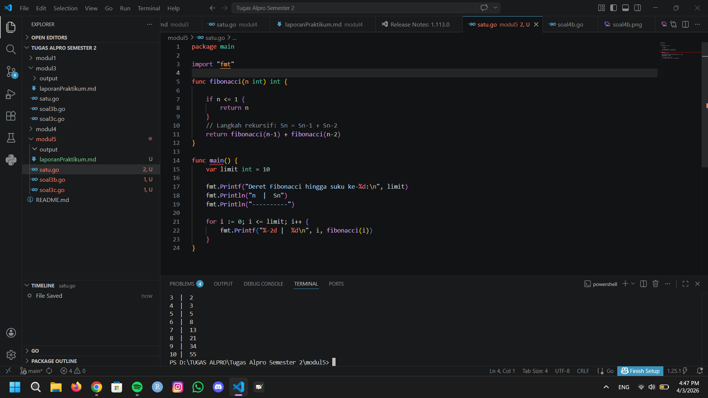
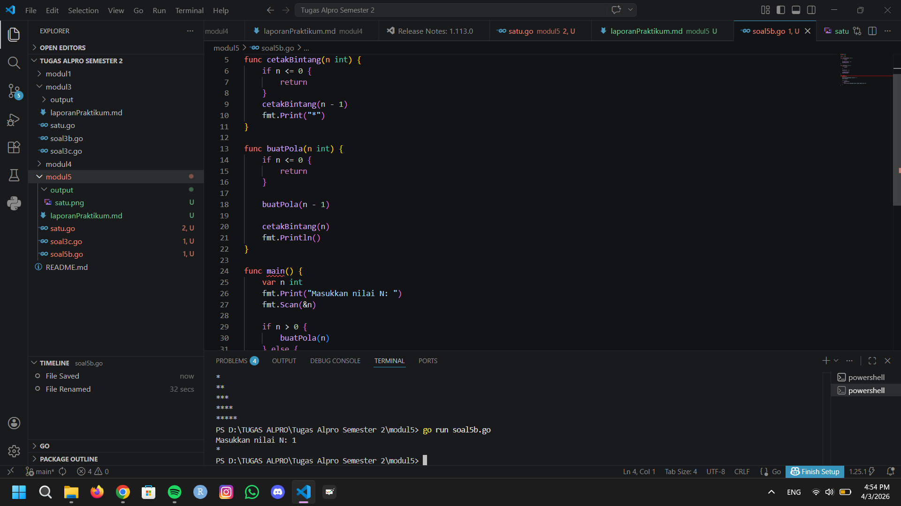
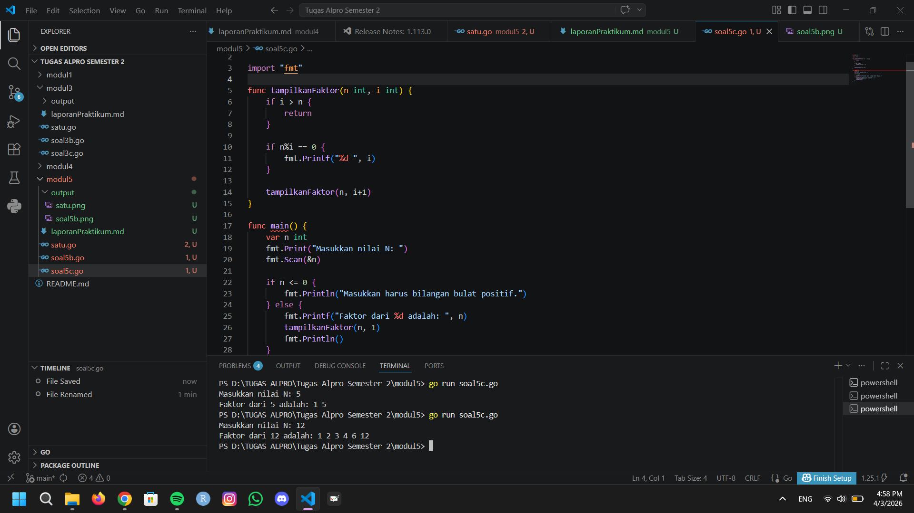

# <h1 align="center">Laporan Praktikum Modul 5- ... </h1>
<p align="center">Wahhaj - 109082530020</p>

## Unguided 

### 1. [Soal modul 5A]
#### satu.go

```go
package main

import "fmt"

func fibonacci(n int) int {

	if n <= 1 {
		return n
	}
	return fibonacci(n-1) + fibonacci(n-2)
}

func main() {
	var limit int = 10

	fmt.Printf("Deret Fibonacci hingga suku ke-%d:\n", limit)
	fmt.Println("n  |  Sn")
	fmt.Println("----------")

	for i := 0; i <= limit; i++ {
		fmt.Printf("%-2d |  %d\n", i, fibonacci(i))
	}
}
```
### Output Unguided :

##### Output 

[penjelasan]
  Jadi kode tersebut digunakan mengimplementasikan deret Fibonacci.

  ### 2. [Soal modul 5B]
#### soal5b.go

```go
package main

import "fmt"

func cetakBintang(n int) {
	if n <= 0 {
		return
	}
	cetakBintang(n - 1)
	fmt.Print("*")
}

func buatPola(n int) {
	if n <= 0 {
		return
	}

	buatPola(n - 1)
	
	cetakBintang(n)
	fmt.Println()
}

func main() {
	var n int
	fmt.Print("Masukkan nilai N: ")
	fmt.Scan(&n)

	if n > 0 {
		buatPola(n)
	} else {
		fmt.Println("Masukan harus lebih besar dari 0")
	}
}

```
### Output Unguided :

##### Output 

[penjelasan]
 Jadi kode tersebut digunakan untuk menampilkan pola bintang menggunakan fungsi rekursif.


### 3. [Soal modul 5C]
#### soal5c.go

```go
package main

import "fmt"

func tampilkanFaktor(n int, i int) {
	if i > n {
		return
	}

	if n%i == 0 {
		fmt.Printf("%d ", i)
	}

	tampilkanFaktor(n, i+1)
}

func main() {
	var n int
	fmt.Print("Masukkan nilai N: ")
	fmt.Scan(&n)

	if n <= 0 {
		fmt.Println("Masukkan harus bilangan bulat positif.")
	} else {
		fmt.Printf("Faktor dari %d adalah: ", n)
		tampilkanFaktor(n, 1)
		fmt.Println()
	}
}

```
### Output Unguided :

##### Output 

[penjelasan]
  Jadi kode tersebut digunakan untuk menampilkan faktor bilangan N, atau bilangan yang akan habis jika untuk membagi N.