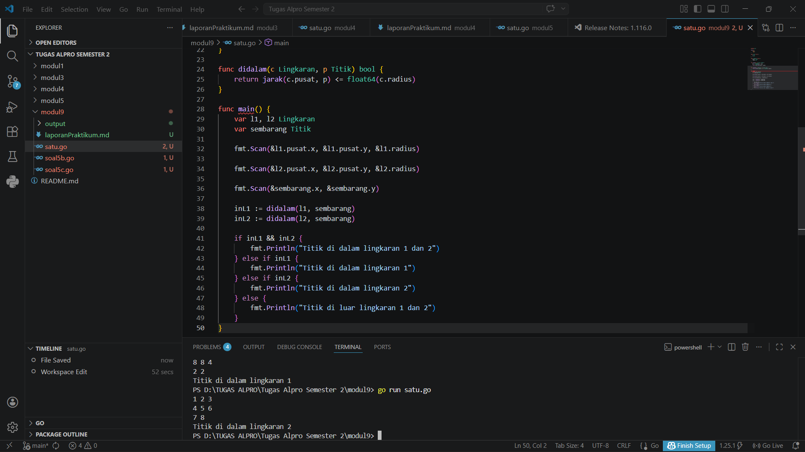
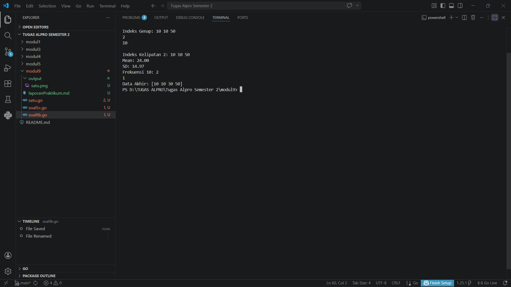
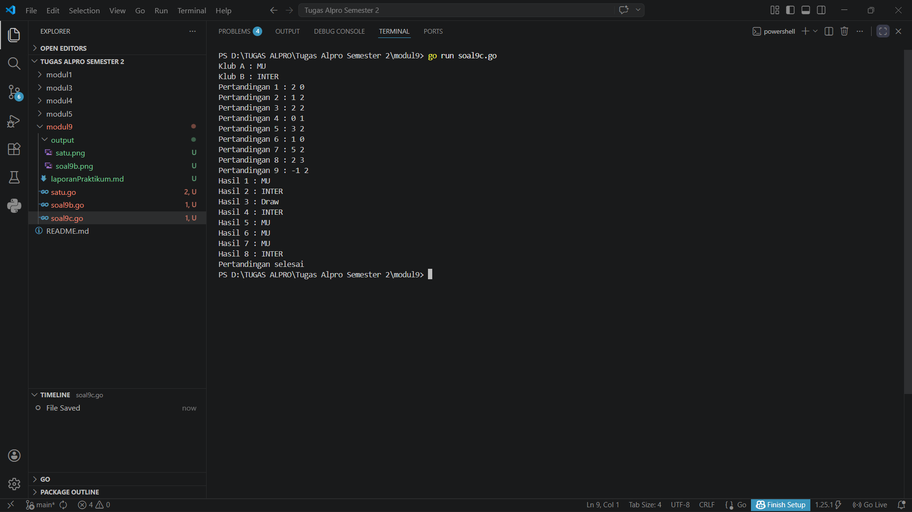
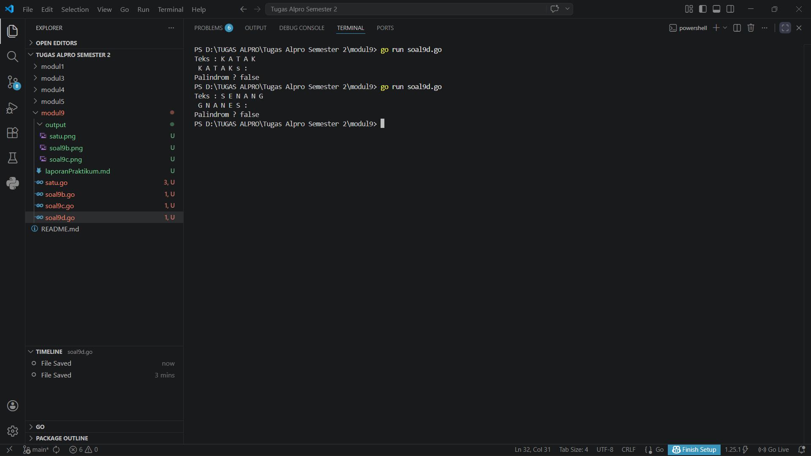

# <h1 align="center">Laporan Praktikum Modul 9- ... </h1>
<p align="center">Wahhaj - 109082530020</p>

## Unguided 

### 1. [Soal modul 9A]
#### satu.go

```go
package main

import (
	"fmt"
	"math"
)

type Titik struct {
	x int
	y int
}

type Lingkaran struct {
	pusat  Titik
	radius int
}

func jarak(p, q Titik) float64 {
	dx := float64(p.x - q.x)
	dy := float64(p.y - q.y)
	return math.Sqrt(dx*dx + dy*dy)
}

func didalam(c Lingkaran, p Titik) bool {
	return jarak(c.pusat, p) <= float64(c.radius)
}

func main() {
	var l1, l2 Lingkaran
	var sembarang Titik

	fmt.Scan(&l1.pusat.x, &l1.pusat.y, &l1.radius)

	fmt.Scan(&l2.pusat.x, &l2.pusat.y, &l2.radius)

	fmt.Scan(&sembarang.x, &sembarang.y)

	inL1 := didalam(l1, sembarang)
	inL2 := didalam(l2, sembarang)

	if inL1 && inL2 {
		fmt.Println("Titik di dalam lingkaran 1 dan 2")
	} else if inL1 {
		fmt.Println("Titik di dalam lingkaran 1")
	} else if inL2 {
		fmt.Println("Titik di dalam lingkaran 2")
	} else {
		fmt.Println("Titik di luar lingkaran 1 dan 2")
	}
}
```
### Output Unguided :

##### Output 

[penjelasan]
  Jadi kode tersebut digunakan untuk menentukan posisi sebuah titik relatif terhadap dua lingkaran.

  ### 2. [Soal modul 9B]
#### soal9b.go

```go
package main

import (
	"fmt"
	"math"
)

func main() {
	var n, x, idx, target int
	fmt.Scan(&n)

	data := make([]int, n)
	sum := 0.0
	for i := 0; i < n; i++ {
		fmt.Scan(&data[i])
		sum += float64(data[i])
	}

	fmt.Println("Isi array:", data)

	fmt.Print("Indeks Ganjil: ")
	for i := 1; i < n; i += 2 {
		fmt.Printf("%d ", data[i])
	}
	fmt.Print("\nIndeks Genap: ")
	for i := 0; i < n; i += 2 {
		fmt.Printf("%d ", data[i])
	}

	fmt.Scan(&x, &target)
	count := 0
	fmt.Printf("\nIndeks Kelipatan %d: ", x)
	for i := 0; i < n; i++ {
		if x > 0 && i%x == 0 {
			fmt.Printf("%d ", data[i])
		}
		if data[i] == target {
			count++
		}
	}

	mean := sum / float64(n)
	var varSum float64
	for i := 0; i < n; i++ {
		selisih := float64(data[i]) - mean
		varSum = varSum + (selisih * selisih)
	}
	sd := math.Sqrt(varSum / float64(n))

	fmt.Printf("\nMean: %.2f\nSD: %.2f\n", mean, sd)
	fmt.Printf("Frekuensi %d: %d\n", target, count)

	fmt.Scan(&idx)
	for i := idx; i < n-1; i++ {
		data[i] = data[i+1]
	}
	data = data[:n-1]
	
	fmt.Println("Data Akhir:", data)
}

```
### Output Unguided :

##### Output 

[penjelasan]
 Jadi kode tersebut digunakan untuk mempraktikkan manipulasi array dan statistik dasar.


### 3. [Soal modul 9C]
#### soal9c.go

```go
package main

import "fmt"

func main() {
	var klubA, klubB string
	var skorA, skorB int
	var pemenang []string

	fmt.Print("Klub A : ")
	fmt.Scan(&klubA)
	fmt.Print("Klub B : ")
	fmt.Scan(&klubB)

	i := 1
	for {
		fmt.Printf("Pertandingan %d : ", i)
		fmt.Scan(&skorA, &skorB)

		if skorA < 0 || skorB < 0 {
			break
		}

		if skorA > skorB {
			pemenang = append(pemenang, klubA)
		} else if skorB > skorA {
			pemenang = append(pemenang, klubB)
		} else {
			pemenang = append(pemenang, "Draw")
		}

		i++
	}

	for j := 0; j < len(pemenang); j++ {
		fmt.Printf("Hasil %d : %s\n", j+1, pemenang[j])
	}

	fmt.Println("Pertandingan selesai")
}

```
### Output Unguided :

##### Output 

[penjelasan]
  Jadi kode tersebut digunakan untuk menyimpan dan menampilkan nama-nama klub yang
memenangkan pertandingan bola pada suatu grup pertandingan.


### 3. [Soal modul 9D]
#### soal9d.go

```go
package main

import "fmt"

const NMAX int = 127

type tabel [NMAX]rune

func isiArray(t *tabel, n *int) {
	var input rune
	*n = 0
	for *n < NMAX {
		fmt.Scanf("%c", &input)
		if input == '.' || input == '\n' {
			break
		}
		if input != ' ' {
			t[*n] = input
			*n++
		}
	}
}

func cetakArray(t tabel, n int) {
	for i := 0; i < n; i++ {
		fmt.Printf("%c ", t[i])
	}
	fmt.Println()
}

func balikanArray(t *tabel, n int) {
	for i := 0; i < n/2; i++ {
		temp := t[i]
		t[i] = t[n-1-i]
		t[n-1-i] = temp
	}
}

func palindrom(t tabel, n int) bool {

	asli := t

	balikanArray(&t, n)
	
	for i := 0; i < n; i++ {
		if asli[i] != t[i] {
			return false
		}
	}
	return true
}

func main() {
	var tab tabel
	var m int

	fmt.Print("Teks : ")
	isiArray(&tab, &m)

	isPalin := palindrom(tab, m)

	fmt.Print("Reverse teks : ")
	balikanArray(&tab, m)
	cetakArray(tab, m)

	fmt.Printf("Palindrom ? %t\n", isPalin)
}
```
### Output Unguided :

##### Output 

[penjelasan]
  Jadi kode tersebut digunakan untuk melakukan membalikkan urutan isi array dan memeriksa
apakah membentuk palindrom.